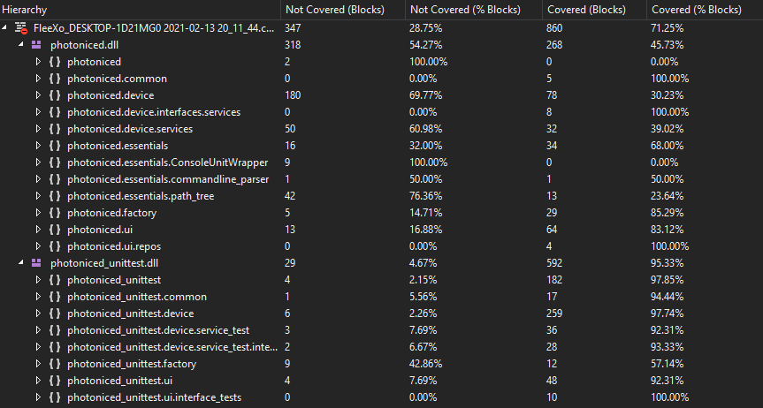
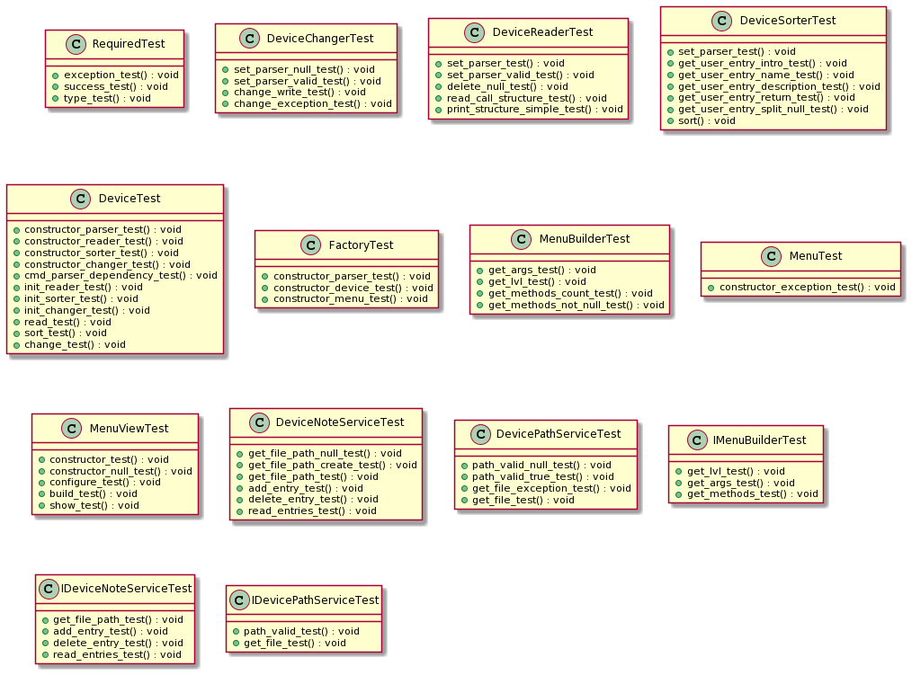
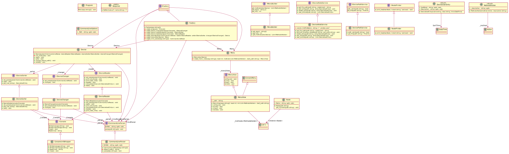
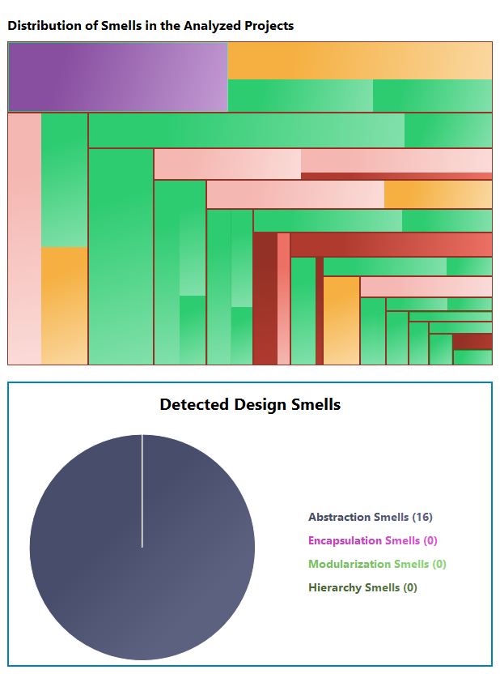
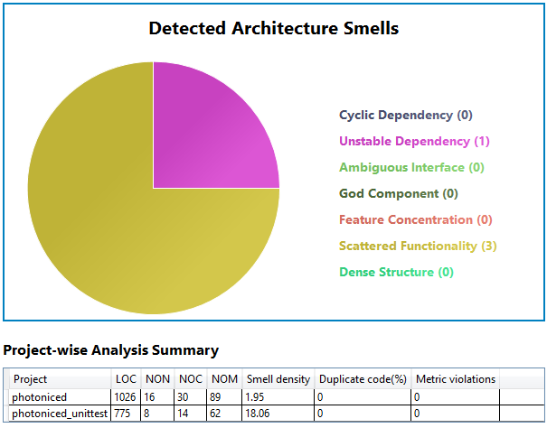
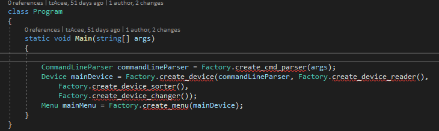
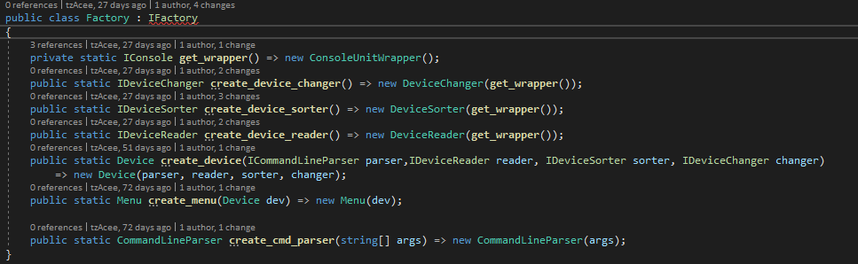
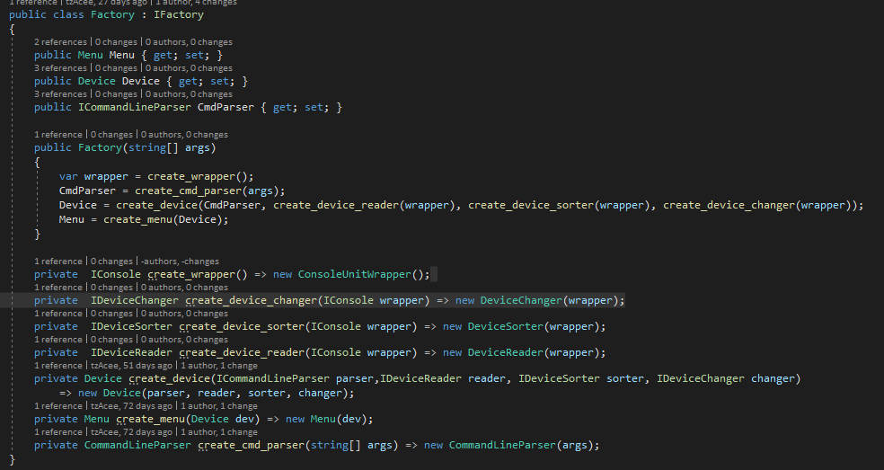
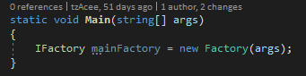

# Dokumentation: Photonized
  - [Was ist Photonized?](#was-ist-photoniced)
  - [Wie lasse ich die Software laufen?](#wie-lasse-ich-die-software-laufen)
	- [Startparameter](#params)
  - [Frameworks](#frameworks)
  - [Unit Testing](#testi)
  - [Clean Architecture](#clean-architecture)
  - [Domain Driven Design](#domain-driven-design)
  - [Refactoring](#refactoring)
  - [Programming Principles](#princ)
  - [Entwurfsmuster](#entwurfsmuster)

<a name="what"></a>
## Was ist Photonized?
Photonized ist eine Software, welche im Zuge eines Programmentwurfs für die TINF18B4 Advanced Software Engineering Vorlesung entwickelt wurde.
Die Anwendung dient dazu, Bilder in selbst festgelegte Ordner zu sortieren.
Durch eine minimalistische Darstellung, basierender auf einer Konsolenanwendung, ist die Handhabung sehr durchsichtig.


Die Ordner werden relativ zum Ortspfad der Anwendung erstellt. Das heißt: Wird photonized in "/home/test/" ausgeführt, werden auch die Ordner in "/home/test/*" erstellt. Dieser Pfad kann entweder über einen [Startparameter](#params) oder direkt in der Anwendung ("Change Device Path") verändert werden. Der derzeitige Device Pfad wird im Titel der Konsolenanwendung angezeigt.

Um nun Bilder zu sortieren, muss zunächst "Sort Device" angewählt werden. Man wird direkt aufgefordert ein Datum anzugeben, an dem die Fotos, die man sortieren möchte, erstellt wurden. Dies ist auch das **Sortierkriterium**. Bei ungültigem Format wird ein Fehler geworfen.
Sobald man ein Datum festgelegt hat, soll man ein Schlagwort (Im Optimalfall ein Ereignis) angeben, welches den Tag zusammenfasst. Zum Beispiel, wenn man nach Urlaubsereignissen sortiert, wäre "Sightseeing" ein Schlagwort.

Im nächste Schritt soll man das Ereignis etwas genauer beschreiben, damit man sich z.B. auch nach längerer Zeit an das Ereignis wieder errinnern kann.


Um die sich im Workspace befindlichen Sortierungen anzuschauen, muss "Read Device" ausgewählt werden.


Um eine Sortierung zu löschen, muss dementsprechend "Delete Entry from Device" ausgewählt werden.


Jegliche angegebenen Meta Daten werden in einer ".photon.json" gespeichert und ausgelesen. Obwohl Konsistenz größtenteils gewährleistet ist, ist es nicht empfehlenswert diese Datei von Hand zu verändern.
<a name="run"></a>
## Wie lasse ich die Software laufen?
Bei der Software handelt sich um eine in C# entwickelte dotnet 3.1 Anwendung. Sie ist somit plattformübergreifend lauffähig.

Um die Anwendung zum Laufen zu bekommen sind im Grunde zwei Schritte zu tun.
Der erste ist, die externen Bibliotheken, sowie Abhängigkeiten wiederherzustellen.
Dies geschieht über `dotnet restore`

Als nächstes kann die Anwendung über `dotnet run` gestartet werden (über diesen Befehl können auch die Startparameter übergeben werden, sofern man die Anwendung nicht über die Binaries startet. Sonst muss man die Parameter Betriebssystem spezifisch, beim Anwendungsstart, übergeben).

(Code wurde in Visual Studio (Windows) und in Rider (Linux) programmiert, somit sollte es direkt laufen, wenn man es damit startet)
<a name="params"></a>
### Startparameter
`-p oder --path`: Setzt den Device Pfad ("./" standardmäßig).
<a name="frameworks"></a>
## Frameworks
*Software Dependencies:*

`CommandLineParser`: Einlesen der Startparameter.

`ConsoleMenu-simple`: Gesamte Viewschicht. Notwending für die Menünavigation.

`NewtonSoft.Json`: Verarbeitung von JSON Dateien.


*Test Dependencies:*


`MSTest`: Testframework

`Moq`: Mocking von Objekten, etc.

<a name="testi"></a>
## Unit Testing
Unit Testing war ein essentieller Part während des Programmsentwurfs. Wie oben schon erwähnt wurde MSTest zum Testen und Moq zum Mocken verwendet.
Die Test- sowie Codecoverage ist aus dem nächsten Bild zu entnehmen.


Wie man sieht sind noch nicht alle Tests implementiert, jedoch würde dies ebenfalls die Codezeilengrenze überschreiten. Denn es wurde zum Beispiel ein Console Wrapper (um die Konsole "mockbar" zu machen) geschrieben, jedoch kein Wrapper für die "File" Klasse von C#. Die Console Wrapper Klasse ist nebenbei unter [Refactoring](#refactoring) zu finden.

Das Prinzip der geschriebenen Tests ist relativ simpel. Die erste Eigenschaft ist, dass die Tests sich jeweils immer nur um maximal einen "Use Case" kümmern sollen, denn so weiß man ganz genau, wo auch der Fehler entstanden ist. Einfachheitshalber wurde dann auch nur ein `Assert` bzw. ein (ein weiteres bei chronologischen Abläufen) `Setup` pro Test verwendet.

Weitere Eigenschaften der Tests sind "isoliert" und "zustandslos". Letzteres ist ziemlich klar. Die Testklasse, soll einfach keinen Zustand speichern/haben. Isoliert heißt, dass die individuellen Tests die anderen nicht beeinflussen.


Ein Mock mit dem Framework war ziemlich einfach, ein Beispielt sieht so aus: `var reader = new Mock<IDeviceReader>()`, um auf das Objekt direkt zuzugreifen müsste man auf `reader.Object` zugreifen.

Um einen Funktionsaufruf zu überprüfen, muss man entweder direkt `Verify` aufrufen (`Mock.Get(view).Verify((m)=>m.render(), Times.Once);`) oder vorher ein Setup mit den genauen Funktionen aufbauen und später dann ein `Verify` aufrufen:
```
            console.Setup(fun => fun.Clear());
            console.Setup(fun => fun.WriteLine("Device Structure: (Any Key to continue)"));
            console.Setup(fun => fun.ReadLine()).Returns("");

            reader.read();

            console.VerifyAll();
```


<a name="clean"></a>
## Clean Architecture
Die Software besteht, um es zusammenfassen, aus drei Schichten.
Einer Präsentationsschicht (hier Plugins), einer Vorbereitungsschicht (Adapters) und einer logischen Schicht (in dem Fall Domain Code).
Die Logikschicht ist im Modul `device` zu finden und ist dafür zuständig auf die Festplatte zuzugreifen, die Daten zu verwalten und später auch an die "View" zu übergeben. Dort sind die meisten Business Objects vorzufinden, sowie die allgemeine Logik implementiert. Diese ist bis auf den Ort unveränderlich. Dort sind die hauptsächlichen Regeln festgelegt, wie beispielsweise, wie ein Sortiereintrag auszusehen hat (durch den DeviceUserEntry, sowie die zugrundeliegenden Submodelle). Durch diese Abkopplung bleibt dem Nutzer diese Schicht verborgen. Hier findet die meiste Logik und die Kernfunktionalität statt, das hat den Sinn, dass der Nutzer am Ende nur die Funktionen nutzen kann, die ihm auch zur Verfügung stehen sollten. Die Funktionen der innersten Schicht können problemlos an die äußerste Schicht weitergereicht werden, was für dieses Argument enorm wichtig ist.

Die Trennung der Adapters, sowie der Plugins ist nicht ganz klar, weshalb die Erläuterung hier notwendig ist.
Die Vorbereitungsschicht ist im MenuBuilder zu finden, dort werden die Methoden zu den Titeln für das Menü vorbereitet, damit diese funktionsgemäß angezeigt werden können. Im MenuView wird dies dann über build() in die View übertragen. Diese Schicht baut durch die Hin & Herreieichung der Funktion der der inneren Schicht einen Adaptercharakter zwischen den Schichten auf. Auch diese Schicht bleibt dem Nutzer mehr oder weniger verborgen. Der Sinn dieser Schicht ist, dass die Daten nicht ohne weiteres angezeigt werden können, d.h. z.B., dass die Menüeinträge in einem bestimmten Schema, mit spezieller Funktionalität dargelegt werden müssen, außerdem müssen die Startparameter irgendwo verarbeitet werden. Diese Verarbeitung soll ebenfalls vom Nutzer nicht gesehen werden.

Die Präsentationsschicht ist, wie die Adaptersschicht im Modul `ui` zu finden und braucht eine dringende Referenz auf das `device`, um an die Daten sowie die `MethodsHolder` zukommen, damit man die einzelnen Menüpunkte zu den Funktionen aus dem `device` zuordnen kann. Der Nutzer kann über diese Schicht die Funktionen der inneren Schicht aufrufen bzw. indirekt verwenden (aber nicht verändern). Diese Schicht sieht der Nutzer und kann die ihm dargelegten Funktionen nutzen. Da es sich um eine nutzergetriebene Applikation handelt, muss dieser auch irgendwie an die Funktion kommen, diese werden in dieser Schicht präsentiert, sowie intern limitiert bzw. an den Nutzer angepasst.

Jede Schicht wird in der `Factory` bereitgestellt.



<a name="DDD"></a>
## Domain Driven Design
Die Dömäne des Projekts dürfte relativ klar sein, es handelt sich um Dateiverwaltung bzw. detaillierter, Bildersortierung.
Um auf einen Nenner bei der Programmierung und dem Verständnis zu kommen, muss die Ubiquitous Language analysiert werden.
Die Ubiquitous Language ist aus verschiedenen Keywords aufgebaut, die im folgenden tabellarisch dargelegt werden:
Keyword | Beschreibung 
-------- | -------- 
Device | Abbildung der Festplatte innerhalb der Sprache. Beinhaltet den gesamten Zugriff auf die ausgewählte Festplatte (lesen, schreiben, sortieren).
DeviceChanger | Verändert den Zugriffsort (bzw. allgemein Metadaten) innerhalb der Festplatte (z.B. Pfad). Teil des Device.
DeviceReader | Liest die hinterlegten Einträge in der Partition innerhalb der Festplatte. Teil des Device.
DeviceSorter | Sortiert die Einträge nach Nutzereingaben in der ausgewählten Partition innerhalb der Festplatte. Teil des Device.    
CommandLineParser | Repräsentiert die vom Nutzer eingegebenen Daten, sodass sie vom Device gelesen werden können.
CommandLineOptions | Gibt die Möglichkeiten zur Parametrierung des Devices an. 
Node | Repräsentiert einen Ordner innerhalb eines Verzeichnisses (beinhaltet Kinder, die als Unterverzeichnisse im Device dargestellt werden). 
MethodsHolder | Repräsentieren die Funktionalität der visuellen Schicht, durch die Funktion und dem dazugehörigen Titel .
DeviceUserEntry | Stellt die Struktur der Nutzereingabe beim Sortieren dar.   
Menu | Beinhaltet die Darstellung des Menüs. Gibt das an, was der Nutzer am Ende zu sehen bekommt.
MenuBuider | Erzeugt aus den MethodsHoldern, visuelle Menüeinträge.
MenuView | Verwaltet die Sicht bzw. den Aufbau des Menüs. Greift auf den MenuBuilder zurück, um die Menüeinträge herzustellen.

#### Analyse & Begründung der verwendeten Muster
Außerdem wurden einige taktische Muster des DDD verwendet. Die im folgenden aufgezeigt werden.
###### Value Objects
Zum Darstellen der Menüfelder wurden auch Value Objects - z.B. der MethodsHolder - verwendet. Dieser beinhaltet die Action & den Titel der Action im Menü. Die Action ist in dem Fall einfach eine fixe, festgelegte Funktion, die ausgeführt wird. Das gesamte Objekt ist völlig unveränderlich und befindet sich in einem "as it is" Zustand. Vorallem beim festlegen der Funktion ist die Unveränderlichkeit ein entscheidender Punkt, da dieser zu jedem Zeitpunkt von frei von Seiteneffekten bleibt und somit ungewolltes Verhalten vorbeugt. Außerdem ist das Objekt ebenfalls zu jedem Zeitpunkt gültig.
###### Entities
In diesem Projekt gibt es nicht direkt Entities mit einer festen ID, dennoch kann man beim Device von einer Entität sprechen, dieses wird durch einen klaren Pfad festgelegt, außerdem ist das Device sowohl zur Initialisierung als auch zur Laufzeit ständig gültig. Mit der Laufzeit führt das Device verschiedenen Methoden durch (sort, read) und kann auch verändert (change) werden. Dieses Verhalten wird jedoch wiedderum in die einzelnen Submodule ausgelagert. Problem daran, dass die Identität keine ID ist, ist dass der Pfad selbst verändert werden kann & auch soll. Dennoch ist dieser eindeutig, da die Anwendung nur auf einem Rechner läuft und die Pfade nur einmalig verfügbar sind. Dadurch wird dieser mehr oder weniger aussagekräftig und beschreibt das Device sehr gut.

Man könnte beispielsweise die DeviceUserEntries als Entitäten definieren, diese werden jedoch nicht direkt als Objekt im Programm gespeichert, sondern innerhalb der JSON Datei als verhaltenloses struct und später ebenfalls als struct wieder eingelesen. Dort wäre die Identität durch das SortierWord und das Datum gegeben. Außerdem sind diese durch das Device innerhalb des Lebenszyklus veränderbar.
###### Aggregates
Die Deviceklasse bildet das Agregat Muster. Wenn man ein Device anfordert, wird immer der Reader, Changer und Sorter mitgeliefert. Alle außenstehenden Objekte kommunizieren nicht direkt mit den einzelnen "Submodulen", sondern nur mit dem Device. Dadurch wird das Device selbst das Aggregate Root Entity. Auf die innernen Elemente wird nur temporär zugegriffen, sofern dies angefordert wird. Beim Device handelt es sich um ein unvollständiges CRUD Modul (Es ist nur CRD [add, read, delete] gegeben). 
Durch die Abkopplung gibt es eine ganz klare Transaktionsgrenze, also das jegliche Aktion allein über das Device läuft, wodurch wiederrum Domänenregeln sichergestellt werden.
###### Repositories
In dem Projekt gibt es leider keine vollständigen Repositories. Das zuvor beschriebene Aggregat befindet sich im innersten der Architektur, weshalb dieses auch nur einmalig existiert, sowie alles verwaltet und ein Repository dafür nicht zweckerfüllend wäre.
Dennoch wurde ein DeviceReaderRepository (Im nachhinnein) angelegt, welches die hinterlegten DeviceUserEntries ausliest und als Liste zurückgibt. Definiert ist das Repository innerhalb des DeviceReaders. Somit dient das Repository als Adapter zum Datenbestand.
Das könnte man analog zum Hinzufügen noch im Sorter machen, jedoch wäre dies erneut ein weiteres Repository mit nur einer Funktion, weshalb es zunächst im Service verweilt.
###### Domain Services
Das wohl gängiste Muster sind die Domain Services, welche sich in den Modulen innerhalb der "services" Ordner befinden. Diese sind dazu gedacht unabhängige bzw. komplett isolierte Aufgabe durchzuführen. Wie zum Beispiel aus einem Pfadstring, den Filenamen zu extrahieren. Da sie nur eine bestimmte Aufgabe erfüllen, sind sie auch zustandslos. Die Services dort können nicht direkt einer Entität oder einem Value Object zugeordnet werden, da sie wie erwähnt unabhängig intialisiert wurden. So kann z.B. die zuvor genannte Funktion sowohl im Device, als auch im CommandlineParser Gebrauch finden. 

Der DeviceNoteService greift beispielsweise direkt auf die FileSystem Bibliothek zurück um die nötigen Informationen zu bekommen.
Der DevicePathService hat in der Funktion get_file() Referenzen von Value Objects, wie dem DeviceSorter oder auch von dem Service DeviceNoteService, weshalb man keine eindeutige Zuordnung feststellen kann.
Die Services selbst werden zunächst als Interface (Vertrag) definiert und später in dem dem Service selbst implementiert. Das Domänenmodell gibt also zunächst vor, welches Ergebnis erwartet wird.

<a name="refactor"></a>
## Refactoring
Zunächst wurde eine Refactoring für das Unit Testing betrieben, denn in C# kann man die Console Klasse nicht direkt testen. Man muss diese zunächst Wrappen und innerhalb der Unit Tests mocken.


Um Code-Smells richtig zu analysieren wurde eine Visual Studio Extension, namens Designite benutzt. Diese bietet einen Haufen an Details über den geschrieben Code und zeigt unter Anderem auch die erkannten Code-Smells an. In dem Fall wird sich auch nur auf diese Smells fokusiert:

 |  |


So sieht die Übersicht nach einer Projektanalyse aus. Logischerweise sind im Unit-Testing Projekt mehr Smells, da diese mehr oder weniger einer bestimmten Struktur folgen und zum Teil auch auto-generiert sind.

Als Beispiel wird hier nur das Refactoring der Implementation-Smells behandelt. Andere Smells wurden intern gelöst.
Der erste Schritt ist die beiden Magic Numbers aufzulösen. Hier ein Beispiel aus dem DeviceSorter:


```
Magic Number: 
The smell arises when a potentially unexplained literal is used in an expression.
The following statement contains a magic number:
dateSplitted.Length != 3
```
Das Ganze lässt sich einfach durch eine konstante Variable lösen. Der Sinn diesen Smell aufzulösen ist, dass Magic Numbers von Leuten, die den Code nicht kennen, nicht ohne weiteres gedeutet werden können und nicht verstehen können, wieso nun genau diese Nummer da steht. Weshalb Hintergrundwissen durch einen Variablen Namen helfen kann.

Ein anderer Smell ist das Long-Statment:
```
Long Statement: 
The smell arises when a statement is long.
The length of the statement 
"                    File.Delete(entry); // either auth exception or double file exception -> so delete (which follows another exception, when auth)
" is 127.
```
Das lässt sich auflösen indem, man den Kommentar mehrzeilig macht. Diesen Smell aufzulösen macht vorallem wegen der Übersichtlichkeit und der Lesbarkeit des Codes Sinn. Denn man will ohne weiteres Scrollen Inhalte des Codes lesen können.
<a name="princ"></a>
## Programming Principles
#### KISS
Um die Software möglichst simpel zu halten, wurde auf eine größere Viewschicht verzichtet. Da es zum Teil mehrere tausend Bilder sein können, wäre auch ein Click-To-Select Feature nicht allzu sinnvoll. Somit ist eine simple Konsolenanwendung optimal.
Außerdem basiert die Anwendung zunächst auf dem "Denial of Service" Prinzip. D.h. bei falscher Eingabe wird das Programm mit einer Exception abgebrochen. Das ist auf jeden Fall nicht die nutzerfreundlichste Lösung, aber zu dem Zeitpunkt, die Sicherste, sowie Simpelste.

#### GRASP
In der Präsentationsschicht wird sehr auf Polymorphismus gesetzt (s. `MenuView`), um unnötige Komplikationen zu vermeiden. Obwohl vom genutzen Framework die Polymorphie gefordert ist, vermittelt der Aufbau dadurch eine sehr strikte Objektorientierung des Projekts.
Allgemein werden sehr viele Klassen bzw. Subsysteme (s. `device`) angelegt, um eine möglichst hohe Kohäsion (High Cohesion) zu erzeugen.
Das macht den Code an sich übersichtlicherer und logischerweise auch strukturierter, da man dadurch (bspw. allein durch die Namensgebung) genau weiß, welche Klassen zueinander gehören.

#### DRY
Um Wiederholungen zu vermeiden wurde Abläufe entweder in Funktionen ausgelagert oder es wurde, je nach dem, direkt ein ganzer Services geschrieben. Beispielsweise der DeviceNoteService. Die Funktion read_entries(*) wird von unterschiedlichen (& unabhängigen) Funktionen aufgerufen, ist jedoch selbst nur einmal definiert. 

#### SOLID
Durch das Single Resposibility Principle, ist jede Klasse auf eine eigene Funktion limitiert, jede weitere abhängige Funktion wird in eine zusätzliche Klasse ausgelagert (DeviceReader, Sorter, etc..). Der Sinn davon ist die Unit Tests später einfacher zu machen, also damit man nicht noch zusätzliche Refactorings diesbezüglich machen muss. Außerdem werden die Klassen dadurch kompakter, wodurch die Lesbarkeit und die Möglichkeit diese auch später zu verbessern, besser wird.
Durch die Factory Lösung und die klare Schichtarchitektur, kann jedes einzelne Modul durch weitere Module einfach erweitert werden. Jedes einzelne Objekt innerhalb der Factory sind auch `public`.

<a name="entwurf"></a>
## Entwurfsmuster
Von Beginn an war geplant eine Factory zu verwenden. Jedoch erstmal nur experimentell, wie es in folgendem Bild zu sehen ist. Es werden ständig neue Objekte erzeugt, was logischerweise zu inkosistenzen führen kann.



Nachdem eine richtige Factory umgesetzt wurde, konnte diese endlich richtig verwendet werden.



Der Zweck der Factory ist, dass man innerhalb von Klassen keine `new`-Keywords hat. Sondern eben nur in der Factory. Das hilft Inkosistenzen durch doppelte Objekte zu vermeiden. 

